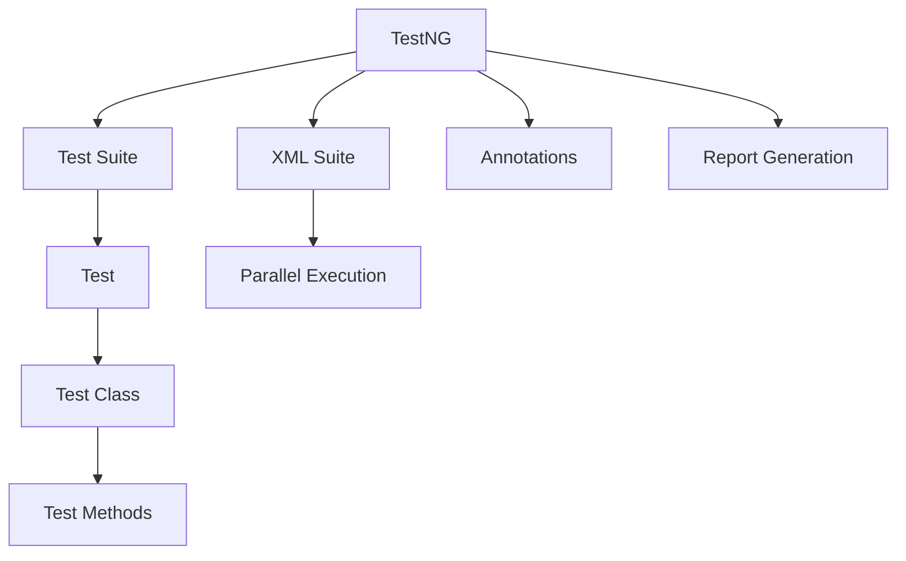
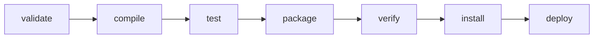
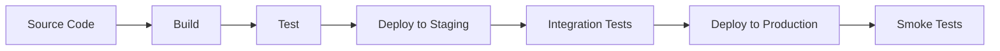
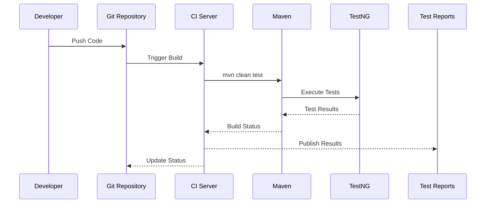

# TestNG, Maven & CI/CD Pipeline Architecture

This document provides an overview of the architecture and integration between TestNG, Maven, and CI/CD pipelines in a Selenium test automation framework.

## Table of Contents
1. [TestNG Architecture](#testng-architecture)
2. [Maven Build Lifecycle](#maven-build-lifecycle)
3. [CI/CD Pipeline Architecture](#cicd-pipeline-architecture)
4. [Integration of TestNG with Maven](#integration-of-testng-with-maven)
5. [Best Practices](#best-practices)

## TestNG Architecture

TestNG is a testing framework inspired by JUnit but introducing new functionalities that make it more powerful and easier to use.

### Key Components:



### TestNG Annotations:
- `@BeforeSuite` / `@AfterSuite`
- `@BeforeTest` / `@AfterTest`
- `@BeforeClass` / `@AfterClass`
- `@BeforeMethod` / `@AfterMethod`
- `@Test`

## Maven Build Lifecycle

Maven automates the build process and manages project dependencies.

### Standard Lifecycle Phases:



### Key Maven Components:
- **POM (Project Object Model)**: `pom.xml`
- **Dependency Management**: Centralized library management
- **Build Lifecycle**: Standardized build process
- **Plugins**: Extend Maven's functionality

## CI/CD Pipeline Architecture

### Typical CI/CD Pipeline Flow:



### GitHub Actions Workflow Components:
1. **Workflow File**: `.github/workflows/selenium-test.yml`
2. **Jobs**: Define what runs on which runner
3. **Steps**: Individual tasks within a job
4. **Actions**: Reusable units of code
5. **Runners**: Servers that run the workflows

## Integration of TestNG with Maven

### Project Structure:
```
src/
├── main/
│   └── java/         # Production code
└── test/
    ├── java/         # Test classes
    └── resources/    # Test resources
        └── testng.xml
pom.xml
```

### Maven Surefire Plugin Configuration:
```xml
<plugin>
    <groupId>org.apache.maven.plugins</groupId>
    <artifactId>maven-surefire-plugin</artifactId>
    <version>3.0.0-M7</version>
    <configuration>
        <suiteXmlFiles>
            <suiteXmlFile>testng.xml</suiteXmlFile>
        </suiteXmlFiles>
    </configuration>
</plugin>
```

## Best Practices

### TestNG Best Practices:
- Use descriptive test method names
- Group related tests using `groups`
- Implement proper test data management
- Use data providers for data-driven testing

### Maven Best Practices:
- Define dependencies with specific versions
- Use Maven properties for versions
- Configure plugins in the build section
- Use profiles for different environments

### CI/CD Best Practices:
- Keep build times fast
- Run tests in parallel when possible
- Implement proper artifact versioning
- Secure sensitive data using secrets

## Visual Workflow

### End-to-End Test Execution Flow:



This architecture ensures a robust, maintainable, and scalable test automation framework integrated with modern CI/CD practices.
