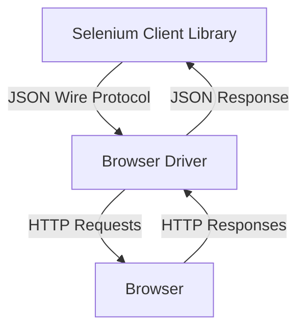
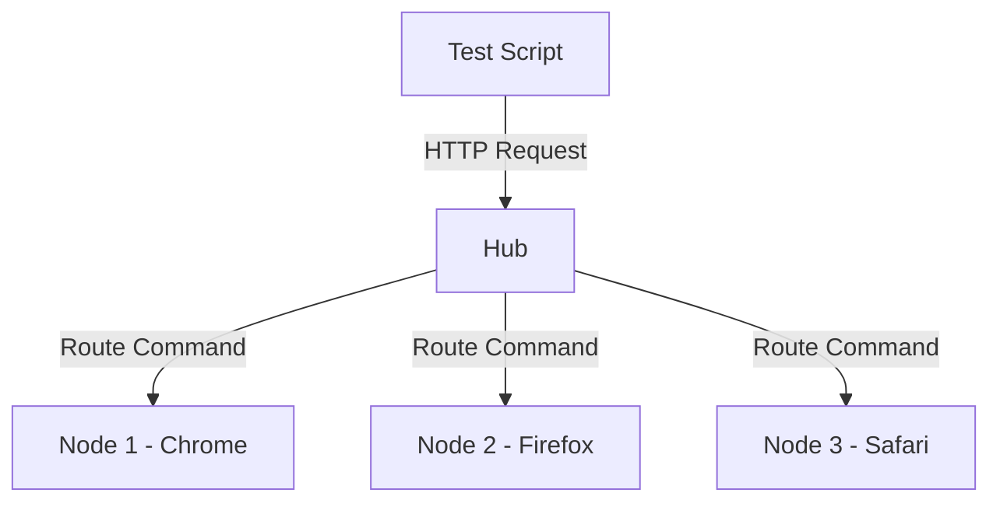

# Selenium Architecture: A Comprehensive Guide

## Table of Contents
1. [Introduction](#introduction)
2. [Selenium Components](#selenium-components)
3. [Architecture Overview](#architecture-overview)
4. [WebDriver Architecture](#webdriver-architecture)
5. [JSON Wire Protocol](#json-wire-protocol)
6. [Browser Drivers](#browser-drivers)
7. [Selenium Grid](#selenium-grid)
8. [Selenium RC vs WebDriver](#selenium-rc-vs-webdriver)

## Introduction
Selenium is a powerful tool for automating web browsers. It provides a single interface for writing test scripts in various programming languages to automate web applications for testing purposes.

## Selenium Components

### 1. Selenium WebDriver
- Core component for browser automation
- Provides programming interface to create and run test cases
- Supports multiple programming languages (Java, Python, C#, Ruby, JavaScript)

### 2. Selenium Grid
- Enables parallel test execution across different machines and browsers
- Consists of Hub and Nodes architecture
- Reduces test execution time

### 3. Selenium IDE
- Record and playback tool
- Browser extension for creating test cases without programming knowledge
- Supports export to multiple programming languages

## Architecture Overview



## WebDriver Architecture

### Key Components:
1. **Selenium Client Libraries**
   - Language-specific bindings (Java, Python, C#, etc.)
   - Provides API for writing test scripts

2. **JSON Wire Protocol**
   - RESTful web service using JSON over HTTP
   - Standard communication protocol between client libraries and browser drivers

3. **Browser Drivers**
   - Act as a bridge between Selenium and the browser
   - Each browser has its own driver (ChromeDriver, GeckoDriver, etc.)
   - Responsible for launching and controlling the browser

4. **Browsers**
   - Actual browsers where tests are executed
   - Chrome, Firefox, Safari, Edge, etc.

## JSON Wire Protocol

### Key Features:
- Language-independent protocol
- Uses standard HTTP requests/responses
- Each command is sent as an HTTP request with JSON payload
- Response contains status and return value in JSON format

### Example Request:
```json
{
  "url": "https://example.com",
  "sessionId": "123456",
  "name": "navigateTo"
}
```

## Browser Drivers

### Popular Browser Drivers:
1. **ChromeDriver** - For Chrome/Chromium browsers
2. **GeckoDriver** - For Firefox browser
3. **SafariDriver** - For Safari browser
4. **Microsoft Edge WebDriver** - For Microsoft Edge

### Responsibilities:
- Launch and terminate the browser
- Handle communication between Selenium and browser
- Convert Selenium commands to browser-specific commands

## Selenium Grid

### Components:
1. **Hub**
   - Central point that receives test requests
   - Routes commands to appropriate nodes
   - Manages test distribution

2. **Node**
   - Registers with the Hub
   - Executes tests on the configured environment
   - Can run on different machines with different browsers/OS

### Grid Architecture:


## Selenium RC vs WebDriver

| Feature         | Selenium RC          | Selenium WebDriver          |
|----------------|---------------------|----------------------------|
| Architecture   | JavaScript-based    | Native browser automation  |
| Speed          | Slower              | Faster                     |
| API            | More complex        | Simpler and more concise   |
| Browser Support| Limited             | Better support             |
| JavaScript     | Required            | Not required               |

## Conclusion
Understanding Selenium's architecture is crucial for writing efficient and reliable test automation scripts. The clear separation between client libraries, browser drivers, and the actual browsers allows for cross-browser testing and parallel execution, making Selenium one of the most powerful tools for web automation testing.

## Additional Resources
- [Selenium Official Documentation](https://www.selenium.dev/documentation/)
- [WebDriver W3C Specification](https://w3c.github.io/webdriver/)
- [Selenium GitHub Repository](https://github.com/SeleniumHQ/selenium)
